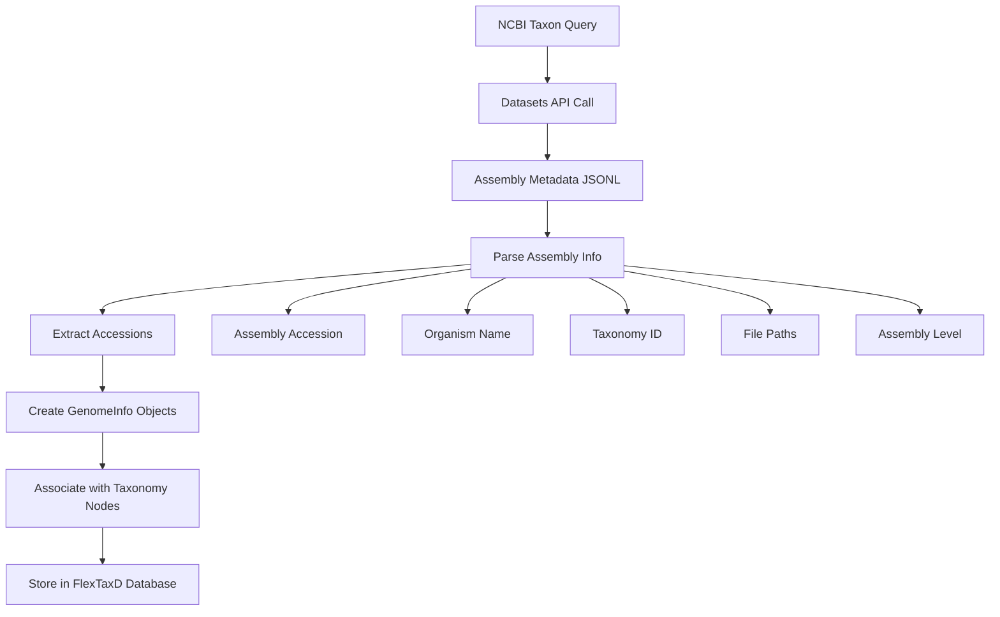

# Genome-Taxonomy Mapping & Accession Management

## Overview

FlexTaxD supports associating genome data with taxonomic nodes and tracking multiple biological database accessions. The software provides genome-taxonomy mapping capabilities for building taxonomy databases with genomic data integration.

This document describes FlexTaxD's genome management features, accession tracking functionality, and implementation approaches for taxonomy databases with genomic data. For general architecture details, see [Architecture Summary](REFACTORING_SUMMARY.md). For development roadmap, see [Development Plan](FLEXTAXD_STRATEGIC_IMPROVEMENT_PLAN.md).

## Key Concepts

### 1. Multiple Genomes Per Taxonomic Node

FlexTaxD supports associating multiple genomes with individual taxonomic nodes, enabling management of strain diversity, clinical isolates, and comparative genomics datasets:

```python
from flextaxd.core.models import GenomeInfo, TaxonomyTree

# Multiple E. coli genomes under the same species node
ecoli_species_id = 562  # NCBI tax_id for Escherichia coli

# Laboratory strain
genome_k12 = GenomeInfo(
    genome_id="ecoli_k12_mg1655",
    tax_id=562,
    assembly_accession="GCF_000005825.2",
    strain="K-12 substr. MG1655",
    source="NCBI",
    description="Laboratory reference strain"
)

# Pathogenic strain  
genome_o157 = GenomeInfo(
    genome_id="ecoli_o157_sakai",
    tax_id=562,
    assembly_accession="GCF_000008865.2", 
    strain="O157:H7 str. Sakai",
    source="NCBI",
    description="Enterohemorrhagic E. coli"
)

# Clinical isolate
genome_clinical = GenomeInfo(
    genome_id="ecoli_clinical_2023_001",
    tax_id=562,
    assembly_accession="GCA_123456789.1",
    strain="Clinical isolate 2023-001",
    source="Custom",
    description="Clinical isolate from hospital"
)

# Add all to the same taxonomic node
tree = TaxonomyTree()
tree.add_genome(genome_k12)
tree.add_genome(genome_o157)
tree.add_genome(genome_clinical)

# Retrieve all genomes for the species
ecoli_genomes = tree.get_genomes_for_node(562)
print(f"Found {len(ecoli_genomes)} E. coli genomes")  # Output: Found 3 E. coli genomes
```

### 2. Hierarchical Genome Association

Genomes can be associated at any taxonomic level, and queries can retrieve genomes from child nodes:

```python
# Genomes associated at different taxonomic levels
family_enterobacteriaceae = 543  # Family level
genus_escherichia = 561         # Genus level  
species_ecoli = 562            # Species level
strain_k12 = 511145            # Strain level

# Associate genomes at different levels
tree.add_genome(GenomeInfo(genome_id="family_representative", tax_id=543))
tree.add_genome(GenomeInfo(genome_id="genus_representative", tax_id=561))
tree.add_genome(GenomeInfo(genome_id="species_representative", tax_id=562))
tree.add_genome(GenomeInfo(genome_id="strain_specific", tax_id=511145))

# Query genomes at family level (includes all descendants)
family_genomes = tree.get_genomes_for_subtree(543)  # Gets all 4 genomes
genus_genomes = tree.get_genomes_for_subtree(561)   # Gets 3 genomes
species_genomes = tree.get_genomes_for_node(562)    # Gets 1 genome (direct association only)
```

## Accession Number Management

### Supported Accession Types

FlexTaxD tracks multiple types of biological database accessions with automatic format validation:

| Field | Accession Type | Format | Examples | Primary Use Case |
|-------|---------------|--------|----------|------------------|
| `assembly_accession` | **Assembly** | GCF_/GCA_ | `GCF_000005825.2` | Genome assemblies (RefSeq/GenBank) |
| `nucleotide_accession` | **Nucleotide** | NC_/NZ_/CP_/AP_ | `NC_000913.3` | Individual chromosomes/contigs |
| `protein_accession` | **Protein** | WP_/YP_/NP_ | `WP_000000001.1` | Representative proteins |
| `sra_accession` | **SRA** | SRR_/ERR_/DRR_ | `SRR12345678` | Raw sequencing reads |
| `biosample_accession` | **BioSample** | SAMN_/SAMD_/SAME_ | `SAMN02604091` | Sample metadata |

### Accession Validation

FlexTaxD includes accession validation with format checking:

```python
# Valid accessions
genome = GenomeInfo(
    genome_id="example",
    tax_id=562,
    assembly_accession="GCF_000005825.2",      # ✅ Valid
    nucleotide_accession="NC_000913.3",       # ✅ Valid
    protein_accession="WP_000000001.1",       # ✅ Valid
    sra_accession="SRR12345678",              # ✅ Valid
    biosample_accession="SAMN02604091"        # ✅ Valid
)

# Validation check
issues = genome.validate_accessions()
print(f"Validation issues: {issues}")  # Output: Validation issues: []

# Invalid accessions
invalid_genome = GenomeInfo(
    genome_id="invalid_example",
    tax_id=562,
    assembly_accession="INVALID_123",          # ❌ Invalid format
    protein_accession="WP_123"                 # ❌ Missing version
)

issues = invalid_genome.validate_accessions()
print(f"Issues found: {len(issues)}")  # Output: Issues found: 2
```

### Accession Priority and Access

FlexTaxD provides utilities to work with multiple accessions:

```python
genome = GenomeInfo(
    genome_id="multi_accession_example",
    tax_id=562,
    assembly_accession="GCF_000005825.2",
    nucleotide_accession="NC_000913.3",
    protein_accession="WP_000000001.1"
)

# Get all available accessions
all_accessions = genome.all_accessions
print(all_accessions)
# Output: {
#   'assembly': 'GCF_000005825.2',
#   'nucleotide': 'NC_000913.3', 
#   'protein': 'WP_000000001.1'
# }

# Get primary accession (preference order: assembly > nucleotide > protein > sra > biosample)
primary = genome.primary_accession
print(f"Primary accession: {primary}")  # Output: Primary accession: GCF_000005825.2
```

## NCBI Datasets Integration

### Automated Genome Discovery

FlexTaxD integrates with NCBI Datasets API for automated genome discovery and metadata extraction:

```bash
# Download all genomes for a taxon
flextaxd datasets --taxon "Escherichia coli" --output-dir ./ecoli --database ecoli.ftd
```

**What happens internally:**

1. **Taxon Resolution**: Resolves "Escherichia coli" to NCBI taxonomy ID(s)
2. **Assembly Discovery**: Queries NCBI Datasets API for all assemblies under the taxon
3. **Metadata Extraction**: Downloads assembly metadata in JSONL format
4. **Accession Parsing**: Extracts assembly accessions from metadata
5. **Taxonomy Association**: Links each assembly to appropriate taxonomic nodes
6. **Database Creation**: Builds FlexTaxD database with genome associations

### Assembly Level Filtering

Control which genome types to include:

```bash
# Only complete genomes (highest quality)
flextaxd datasets --taxon "Francisella" --assembly-level complete --database francisella_complete.ftd

# Chromosome-level assemblies (good quality, more available)
flextaxd datasets --taxon "Salmonella" --assembly-level chromosome --database salmonella_chr.ftd

# All assembly levels (maximum coverage)
flextaxd datasets --taxon "Listeria" --assembly-level all --max-genomes 1000 --database listeria_all.ftd
```

### Assembly Level Hierarchy

| Level | Description | Quality | Typical Count | Use Case |
|-------|-------------|---------|---------------|----------|
| **complete** | Finished genomes | Highest | Fewest | Reference databases, detailed analysis |
| **chromosome** | Chromosome-level | High | Moderate | Population studies, comparative genomics |
| **scaffold** | Scaffold-level | Medium | Many | Diversity studies, phylogenetics |  
| **contig** | Contig-level | Variable | Most | Maximum coverage, screening |
| **all** | All levels | Mixed | All | Comprehensive databases |

## Data Flow Architecture

### NCBI Datasets → FlexTaxD Conversion



### Database Schema Integration

FlexTaxD stores genome information in the SQLite database:

```sql
-- Genomes table structure
CREATE TABLE genomes (
    genome_id TEXT PRIMARY KEY,
    tax_id INTEGER NOT NULL,
    file_path TEXT,
    sequence_length INTEGER,
    sequence_type TEXT,
    assembly_accession TEXT,
    nucleotide_accession TEXT,
    protein_accession TEXT,
    sra_accession TEXT,
    biosample_accession TEXT,
    description TEXT,
    source TEXT,
    strain TEXT,
    FOREIGN KEY (tax_id) REFERENCES nodes (tax_id)
);

-- Index for efficient genome queries
CREATE INDEX idx_genomes_tax_id ON genomes(tax_id);
CREATE INDEX idx_genomes_assembly_acc ON genomes(assembly_accession);
```

## Advanced Use Cases

### 1. Multi-Source Genome Integration

Combine genomes from different sources:

```python
# NCBI RefSeq genome
refseq_genome = GenomeInfo(
    genome_id="ecoli_refseq",
    tax_id=562,
    assembly_accession="GCF_000005825.2",
    source="NCBI_RefSeq"
)

# GTDB genome with different annotation
gtdb_genome = GenomeInfo(
    genome_id="ecoli_gtdb", 
    tax_id=562,
    assembly_accession="GCA_000005825.2",  # GenBank version
    source="GTDB",
    description="GTDB r207 representative"
)

# Custom sequencing project
custom_genome = GenomeInfo(
    genome_id="ecoli_lab_strain",
    tax_id=562,
    file_path="/data/genomes/ecoli_lab_2023.fasta",
    source="Lab_Sequencing",
    strain="Lab strain 2023-A",
    biosample_accession="SAMN99999999"
)
```

### 2. Protein-Centric Databases

For protein classification databases:

```python
# Protein-focused genome entry
protein_genome = GenomeInfo(
    genome_id="ecoli_proteome",
    tax_id=562,
    sequence_type="protein",
    protein_accession="WP_000000001.1",
    file_path="/data/proteins/ecoli_proteins.faa",
    source="NCBI_Protein"
)
```

### 3. Metagenome-Assembled Genomes (MAGs)

Handle MAGs with limited accession information:

```python
# MAG from metagenomic study
mag_genome = GenomeInfo(
    genome_id="MAG_bin_001",
    tax_id=562,  # Best taxonomic assignment
    file_path="/data/mags/bin_001.fasta",
    sequence_type="MAG",
    source="Metagenomics",
    description="Assembled from soil metagenome",
    sra_accession="SRR87654321"  # Source sequencing data
)
```

## Best Practices

### 1. Genome Identification Strategy

- **Use assembly accessions as genome_id** when available (ensures uniqueness)
- **Include strain information** for bacterial genomes
- **Specify sequence_type** clearly (genome/protein/16S/etc.)
- **Track data source** for provenance

### 2. Multi-Strain Management

```python
# Good: Clear strain differentiation
genome_1 = GenomeInfo(
    genome_id="ecoli_k12_mg1655",
    tax_id=562,
    assembly_accession="GCF_000005825.2",
    strain="K-12 substr. MG1655"
)

genome_2 = GenomeInfo(
    genome_id="ecoli_o157_sakai", 
    tax_id=562,
    assembly_accession="GCF_000008865.2",
    strain="O157:H7 str. Sakai"
)

# Bad: Ambiguous identification  
genome_bad = GenomeInfo(
    genome_id="ecoli_genome",  # ❌ Too generic
    tax_id=562
    # ❌ Missing strain info, accessions
)
```

### 3. Quality Control

Always validate genome data:

```python
# Comprehensive validation
def validate_genome_entry(genome: GenomeInfo) -> List[str]:
    issues = []
    
    # Basic validation
    issues.extend(genome.validate())
    
    # Accession validation
    issues.extend(genome.validate_accessions())
    
    # File validation
    if genome.file_path and not genome.has_sequence_file:
        issues.append(f"File not accessible: {genome.file_path}")
    
    # Source validation
    if not genome.source:
        issues.append("Missing data source information")
    
    return issues

# Use in workflows
genome = GenomeInfo(...)
issues = validate_genome_entry(genome)
if issues:
    print(f"⚠️  Genome validation issues: {issues}")
else:
    tree.add_genome(genome)
```

## Integration Examples

### nf-core/createtaxdb Pipeline

FlexTaxD integrates seamlessly with nf-core workflows:

```bash
# Create database for nf-core/createtaxdb
flextaxd datasets --taxon "Bacteria" --assembly-level complete --max-genomes 1000 --database bacteria_refs.ftd
flextaxd export --database bacteria_refs.ftd --format accession2taxid --output accession2taxid.txt
flextaxd export --database bacteria_refs.ftd --format genome_sizes --output genome_sizes.txt
```

### Kraken2/Bracken Workflows

```bash
# Download genomes and create Kraken2 database
flextaxd datasets --taxon "Enterobacteriaceae" --assembly-level chromosome --database entero.ftd
flextaxd export --database entero.ftd --classifier kraken2 --output kraken2_entero/
```

### Custom Pipeline Integration

```python
from flextaxd.database.sqlite import SQLiteTaxonomyRepository

# Load database and query genomes
with SQLiteTaxonomyRepository("bacteria.ftd") as repo:
    # Get all genomes for Escherichia genus
    escherichia_genomes = []
    for tax_id in repo.get_descendants(561):  # Escherichia genus
        genomes = repo.get_genomes_for_node(tax_id)
        escherichia_genomes.extend(genomes)
    
    print(f"Found {len(escherichia_genomes)} Escherichia genomes")
    
    # Filter by assembly accession pattern
    refseq_genomes = [g for g in escherichia_genomes if g.assembly_accession and g.assembly_accession.startswith("GCF_")]
    print(f"RefSeq genomes: {len(refseq_genomes)}")
```

## Troubleshooting

### Common Issues

1. **Multiple genomes not appearing**
   - ✅ Check: `tree.get_genomes_for_node(tax_id)` returns a list
   - ✅ Verify: All genomes have the same `tax_id`

2. **Accession validation failures**
   - ✅ Check: Accession format matches expected patterns
   - ✅ Verify: Version numbers included (e.g., `.1`, `.2`)

3. **NCBI datasets download failures**
   - ✅ Check: NCBI Datasets CLI installed (`flextaxd datasets --check-installation`)
   - ✅ Verify: Taxon name/ID valid (`flextaxd datasets --validate-taxon "name"`)

4. **File association issues**
   - ✅ Check: File paths are absolute, not relative
   - ✅ Verify: Files accessible from database location

### Debugging Commands

```bash
# Check database genome statistics
flextaxd stats --database my_db.ftd --detailed

# Validate database consistency
flextaxd validate --database my_db.ftd --consistency-only

# Export genome information for inspection
flextaxd export --database my_db.ftd --format json | jq '.genomes'
```

FlexTaxD's genome-taxonomy mapping system supports complex taxonomic databases with genomic data integration. The software handles single-genome studies through large-scale microbial diversity projects with multiple genome associations per taxonomic node, providing functionality for bioinformatics workflows requiring taxonomic data management with genomic components.